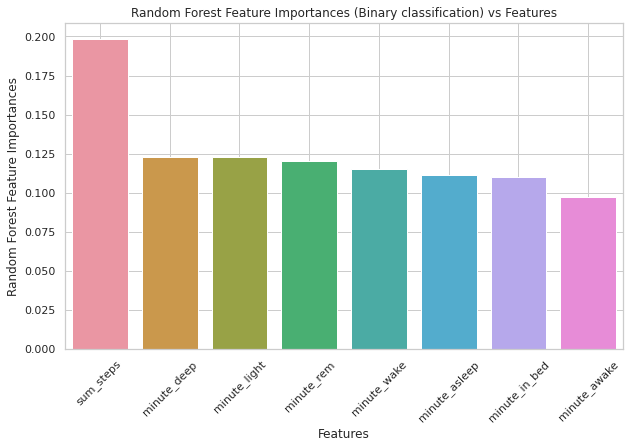
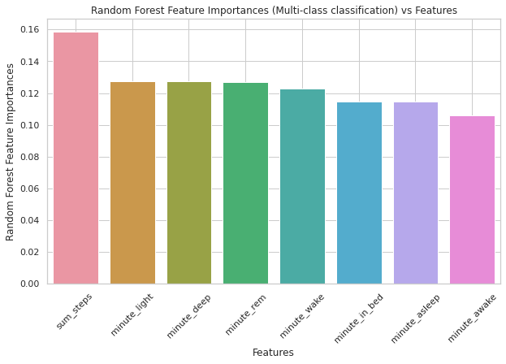

# Investigating the association between Fitbit wearable data and self-reported measures of life satisfaction

This repository contains the code base for our MED-264 group's Final Project.

## Data

The data is part of *All of Us* Registered Tier Dataset (version 7). The notebooks were developed on `Python 3.7` and *All of Us* Jupyter Notebook environment.

## Files

1. [./data_collection.ipynb](data_collection.ipynb) - This notebook extracts the data from *All of Us* dataset using `GoogleBigQuery` query and saves it to the persistent disk on the created workspace.
2. [./data_preprocessing.ipynb](data_preprocessing.ipynb) - In this notebook, the saved dataframes are read and upon observing missingness, the feature list is filtered.
3. [./data_cleaning.ipynb](data_cleaning.ipynb) - In this notebook, the missing data for each feature is imputed with the patient level mean.
4. [./data_splitting.ipynb](data_splitting.ipynb) - In this notebook, the dataset is split into train and test after feature engineering. The split ensures that there is no leakage of patient level data on train and test sets.
5. [./model_building.ipynb](model_building.ipynb) - Traditional machine learning models such as Logistic Regression, Decision Tree Classifier, Random Forest Classifier, and XGBoost Classifier are chosen to perform both multi-class and binary class classification tasks. The results of these are available in the notebooks.

## Explainability of Random Forest Classifier

#### Random Forest Feature Importance (Binary Classification)

#### Random Forest Feature Importance (Multi-class Classification)

## Acknowledgements

We would like thank Dr. Tsung Tim Kuo (instructor) for arranging lectures with various other lecturers for our sessions. We would like to also thank the TAs of this course.